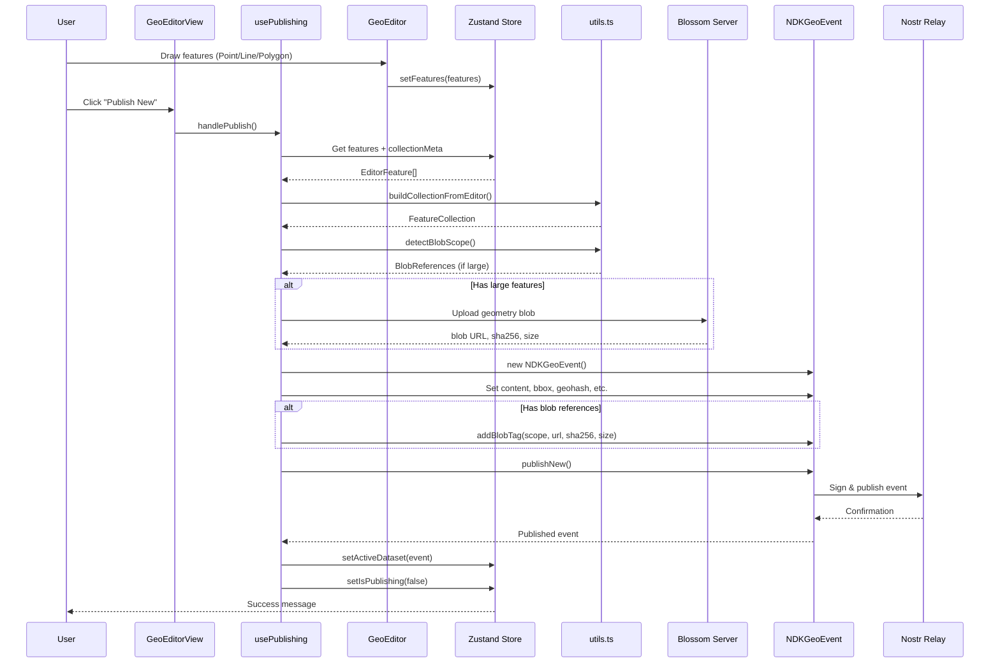
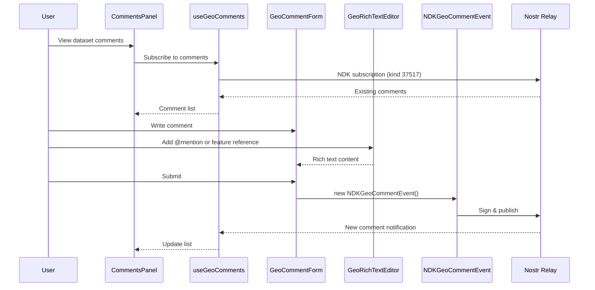
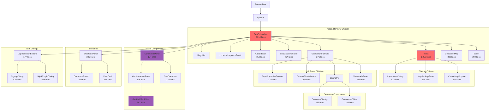

# Earthly - Architecture Analysis & Visualization

Generated: 2025-12-28
Updated: 2026-01-31

## Table of Contents
1. [Directory Structure Overview](#directory-structure-overview)
2. [Architecture Diagrams](#architecture-diagrams)
3. [Component Hierarchy](#component-hierarchy)
4. [Module Dependencies](#module-dependencies)
5. [Function/Method Inventory](#functionmethod-inventory)
6. [Codebase Metrics](#codebase-metrics)

---

## Directory Structure Overview

```
src/
├── components/           # Shared UI components
│   ├── ui/              # Radix-based primitives (30+ components)
│   │   └── search-bar.tsx
│   ├── info-panel/      # InfoPanel sub-components
│   │   ├── index.ts
│   │   ├── ViewModePanel.tsx (497 lines)
│   │   ├── DatasetActionCard.tsx
│   │   ├── DatasetMetadataSection.tsx
│   │   ├── DatasetFeaturesList.tsx (171 lines)
│   │   ├── DatasetSizeIndicator.tsx (303 lines)
│   │   ├── BlobReferencesSection.tsx (123 lines)
│   │   ├── FeaturePropertiesSection.tsx
│   │   ├── StylePropertiesSection.tsx (310 lines)
│   │   └── geometry/
│   │       ├── GeometriesTable.tsx (388 lines)
│   │       └── GeometryDisplay.tsx (341 lines)
│   ├── comments/        # Comment system (1,096 lines total)
│   │   ├── CommentsPanel.tsx (174 lines)
│   │   ├── GeoComment.tsx (235 lines)
│   │   ├── GeoCommentForm.tsx (176 lines)
│   │   ├── GeoMention.tsx (160 lines)
│   │   └── GeoSocialActions.tsx (151 lines)
│   ├── shoutbox/        # City-based discussions (1,922 lines total)
│   │   ├── ShoutboxPanel.tsx (230 lines)
│   │   ├── PostCard.tsx (206 lines)
│   │   ├── PostForm.tsx (123 lines)
│   │   ├── CommentThread.tsx (182 lines)
│   │   ├── useShoutboxComments.ts (202 lines)
│   │   └── types.ts (77 lines)
│   ├── editor/          # Rich text editing (1,432 lines total)
│   │   ├── GeoRichTextEditor.tsx (542 lines)
│   │   ├── GeoMentionExtension.tsx (298 lines)
│   │   ├── MediaExtensions.tsx (223 lines)
│   │   ├── ContentViewer.tsx (84 lines)
│   │   └── contentParser.ts (272 lines)
│   ├── GeoDatasetsPanel.tsx (414 lines)
│   ├── GeoEditorInfoPanel.tsx (271 lines)
│   ├── GeoCollectionEditorPanel.tsx (409 lines)
│   ├── BlossomUploadDialog.tsx (335 lines)
│   ├── AppSidebar.tsx (359 lines)
│   ├── CityPostsPanel.tsx (214 lines)
│   ├── LoginSessionButtom.tsx (177 lines) ⚠️ Typo in filename
│   ├── Nip46LoginDialog.tsx (548 lines)
│   ├── SignupDialog.tsx (429 lines)
│   ├── HelpPanel.tsx (118 lines)
│   ├── HelpPopover.tsx (106 lines)
│   ├── DebugDialog.tsx (38 lines)
│   ├── datasets-columns.tsx
│   └── collections-columns.tsx
│
├── features/
│   └── geo-editor/      # Main editor feature
│       ├── core/        # Editor engine
│       │   ├── GeoEditor.ts (1,823 lines)
│       │   ├── managers/ (6 files, 1,538 lines total)
│       │   │   ├── HistoryManager.ts (102 lines)
│       │   │   ├── SelectionManager.ts (160 lines)
│       │   │   ├── SnapManager.ts (184 lines)
│       │   │   ├── TransformManager.ts (169 lines)
│       │   │   ├── LayerManager.ts (628 lines)
│       │   │   └── RenderingManager.ts (295 lines)
│       │   ├── modes/ (2 files)
│       │   │   ├── DrawMode.ts
│       │   │   └── EditMode.ts
│       │   ├── types/
│       │   └── utils/
│       │       └── geometry.ts
│       ├── components/ (10+ files)
│       │   ├── Editor.tsx (204 lines)
│       │   ├── Map.tsx (839 lines)
│       │   ├── Toolbar.tsx (1,259 lines)
│       │   ├── CreateMapPopover.tsx (646 lines)
│       │   ├── ImportOsmDialog.tsx (523 lines)
│       │   ├── MapSettingsPanel.tsx (345 lines)
│       │   ├── LocationInspectorPanel.tsx
│       │   ├── MobileSearch.tsx
│       │   └── Magnifier.tsx
│       ├── hooks/ (5 files, 1,886 lines total)
│       │   ├── index.ts (12 lines)
│       │   ├── useDatasetManagement.ts (440 lines)
│       │   ├── usePublishing.ts (546 lines)
│       │   ├── useMapLayers.ts (409 lines)
│       │   ├── useRouting.ts (266 lines)
│       │   └── useViewMode.ts (213 lines)
│       ├── GeoEditorView.tsx (2,014 lines)
│       ├── store.ts (658 lines) - Zustand store (50+ actions)
│       ├── types.ts
│       └── utils.ts
│
├── lib/                 # Shared libraries & utilities
│   ├── ndk/            # Nostr Dev Kit wrappers
│   │   ├── NDKGeoEvent.ts (369 lines)
│   │   ├── NDKGeoCommentEvent.ts (388 lines)
│   │   ├── NDKGeoCollectionEvent.ts (152 lines)
│   │   └── NDKMapLayerSetEvent.ts (71 lines)
│   ├── blossom/
│   │   └── blossomUpload.ts (186 lines)
│   ├── geo/
│   │   └── resolveBlobReferences.ts (127 lines)
│   ├── hooks/
│   │   ├── useGeoComments.ts (232 lines)
│   │   ├── useGeoReactions.ts (233 lines)
│   │   ├── useAvailableGeoFeatures.ts (88 lines)
│   │   ├── useStations.ts (181 lines)
│   │   └── useIsMobile.ts (28 lines)
│   ├── fixtures.ts (32 lines)
│   ├── worldGeohash.ts (137 lines)
│   └── utils.ts
│
├── ctxcn/              # MCP Geo Server Client
│   ├── EarthlyGeoServerClient.ts (442 lines)
│   └── index.ts (258 lines)
│
├── config/             # Environment configuration
│   ├── env.schema.ts (86 lines)
│   ├── env.client.ts (124 lines)
│   ├── env.server.ts (48 lines)
│   ├── index.ts (24 lines)
│   └── platform.ts (69 lines)
│
├── App.tsx
├── frontend.tsx (entry point)
├── index.ts - Bun server
├── blossom.ts - Blossom blob server
└── APITester.tsx (76 lines)

map-scripts/            # PMTiles chunking system
├── index.ts (500 lines)
├── geohashWorld.ts
└── geohashWorld.test.ts

relay/                  # Go Khatru relay
└── main.go
```

### File Size Analysis

**Large Files (1000+ lines):**
| File | Lines | Notes |
|------|-------|-------|
| GeoEditorView.tsx | 2,014 | Main orchestration component |
| GeoEditor.ts | 1,823 | Core editing engine |
| Toolbar.tsx | 1,259 | Feature-rich toolbar |

**Medium-Large (500-1000 lines):**
| File | Lines | Notes |
|------|-------|-------|
| Map.tsx | 839 | MapLibre container |
| store.ts | 658 | Zustand state (50+ actions) |
| CreateMapPopover.tsx | 646 | New map creation UI |
| LayerManager.ts | 628 | Map layer management |
| usePublishing.ts | 546 | Publishing workflow hook |
| Nip46LoginDialog.tsx | 548 | NIP-46 authentication |
| GeoRichTextEditor.tsx | 542 | TipTap editor |
| ImportOsmDialog.tsx | 523 | OSM data import |
| ViewModePanel.tsx | 497 | Dataset viewing panel |

**Medium (300-500 lines):**
| File | Lines | Notes |
|------|-------|-------|
| useDatasetManagement.ts | 440 | Dataset CRUD hook |
| EarthlyGeoServerClient.ts | 442 | MCP client |
| SignupDialog.tsx | 429 | User registration |
| useMapLayers.ts | 409 | Layer coordination hook |
| GeoCollectionEditorPanel.tsx | 409 | Collection editing |
| GeometriesTable.tsx | 388 | Geometry list display |
| NDKGeoCommentEvent.ts | 388 | Comment event class |
| NDKGeoEvent.ts | 369 | GeoJSON event class |
| AppSidebar.tsx | 359 | Main sidebar |
| MapSettingsPanel.tsx | 345 | Map configuration |
| GeometryDisplay.tsx | 341 | Geometry visualization |
| BlossomUploadDialog.tsx | 335 | Blob upload UI |
| StylePropertiesSection.tsx | 310 | Style editing |
| DatasetSizeIndicator.tsx | 303 | Size display |

---

## Architecture Diagrams

### 1. High-Level System Architecture

```mermaid
graph TB
    subgraph Client["Frontend (React + Bun)"]
        FE[Frontend Entry<br/>frontend.tsx]
        APP[App.tsx]
        GEV[GeoEditorView<br/>2,014 lines<br/>Main Orchestrator]

        subgraph EditorCore["GeoEditor Core Engine"]
            GE[GeoEditor<br/>1,823 lines]
            HM[HistoryManager]
            SM[SelectionManager]
            SNM[SnapManager]
            TM[TransformManager]
            LM[LayerManager<br/>628 lines]
            RM[RenderingManager]
            DM[DrawMode]
            EM[EditMode]
        end

        subgraph Hooks["Custom Hooks"]
            HP[usePublishing<br/>546 lines]
            HD[useDatasetManagement<br/>440 lines]
            HML[useMapLayers<br/>409 lines]
            HR[useRouting]
            HV[useViewMode]
        end

        subgraph State["State Management"]
            STORE[Zustand Store<br/>658 lines<br/>50+ actions]
        end

        subgraph Social["Social Features"]
            COMMENTS[Comments System<br/>1,096 lines]
            SHOUTBOX[Shoutbox<br/>1,922 lines]
            RICHTEXT[Rich Text Editor<br/>1,432 lines]
        end

        subgraph UI["UI Components"]
            TB[Toolbar<br/>1,259 lines]
            INFO[InfoPanel<br/>2,700 lines total]
            DS[DatasetsPanel<br/>414 lines]
            MAP[MapLibre Map<br/>839 lines]
        end

        FE --> APP --> GEV
        GEV --> GE
        GEV --> STORE
        GEV --> HP & HD & HML & HR & HV
        GEV --> TB & INFO & DS & MAP
        GEV --> COMMENTS & SHOUTBOX
        GE --> HM & SM & SNM & TM & LM & RM
        GE --> DM & EM
        GE -.sync.-> STORE
    end

    subgraph Backend["Backend Services"]
        SRV[Bun Server<br/>index.ts]
        BLOSSOM[Blossom Server<br/>blob storage]
        RELAY[Go Relay<br/>Khatru]
    end

    subgraph External["External Services"]
        MCP[MCP Geo Server<br/>ContextVM]
        PMTILES[PMTiles<br/>Basemaps]
    end

    GEV <--> SRV
    GEV <-.Nostr.-> RELAY
    GEV <-.MCP.-> MCP
    MAP <-.tiles.-> PMTILES
    RELAY --> BLOSSOM
    COMMENTS <-.comments.-> RELAY

    style GE fill:#ff6b6b
    style GEV fill:#ff6b6b
    style TB fill:#ffa06b
    style LM fill:#ffa06b
    style STORE fill:#4ecdc4
    style COMMENTS fill:#9b59b6
    style SHOUTBOX fill:#9b59b6
```



### 2. Data Flow - Publishing a Dataset



### 3. Social Features Flow



---

## Component Hierarchy

### Main Component Tree



---

## Module Dependencies

### Core Module Relationships

```mermaid
graph TB
    subgraph "Entry Point"
        FE[frontend.tsx]
    end

    subgraph "App Layer"
        APP[App.tsx]
        GEV[GeoEditorView]
    end

    subgraph "Custom Hooks"
        HP[usePublishing]
        HD[useDatasetManagement]
        HML[useMapLayers]
        HR[useRouting]
        HV[useViewMode]
    end

    subgraph "Editor Core"
        GE[GeoEditor]
        HIST[HistoryManager]
        SEL[SelectionManager]
        SNAP[SnapManager]
        TRANS[TransformManager]
        LAYER[LayerManager]
        RENDER[RenderingManager]
        DRAW[DrawMode]
        EDIT[EditMode]
    end

    subgraph "State Management"
        STORE[Zustand Store<br/>50+ actions]
    end

    subgraph "NDK Wrappers"
        NDKGEO[NDKGeoEvent<br/>kind 37515]
        NDKCOL[NDKGeoCollectionEvent<br/>kind 37516]
        NDKCOMM[NDKGeoCommentEvent<br/>kind 37517]
        NDKMAP[NDKMapLayerSetEvent]
    end

    subgraph "Social Hooks"
        HGC[useGeoComments]
        HGR[useGeoReactions]
    end

    subgraph "Utilities"
        UTILS[geo-editor/utils.ts]
        BLOB[resolveBlobReferences]
        BUPLOAD[blossomUpload]
        LIBUTILS[lib/utils.ts]
        GEOHASH[worldGeohash]
    end

    subgraph "External Services"
        MCP[EarthlyGeoServerClient<br/>MCP]
    end

    FE --> APP --> GEV
    GEV --> GE
    GEV --> STORE
    GEV --> HP & HD & HML & HR & HV
    GE --> HIST & SEL & SNAP & TRANS & LAYER & RENDER
    GE --> DRAW & EDIT
    HP --> NDKGEO & BUPLOAD
    HD --> NDKGEO & NDKCOL
    HGC --> NDKCOMM
    GEV --> UTILS
    UTILS --> BLOB
    UTILS --> NDKGEO
    GEV --> MCP

    style GE fill:#ff6b6b
    style GEV fill:#ff6b6b
    style STORE fill:#4ecdc4
    style NDKCOMM fill:#9b59b6
```



---

## Function/Method Inventory

### GeoEditor.ts (Core Engine)

**Class:** `GeoEditor` (1,823 lines)

**Public API Methods (20+):**
- `setMode(mode)` - Switch between static/edit/draw modes
- `setFeatures(features)` - Load features into editor
- `getFeatures()` - Get all features
- `setSnappingEnabled(enabled)` - Toggle snapping
- `setPanLocked(locked)` - Lock map panning
- `undo()` / `redo()` - History operations
- `deleteSelected()` - Delete selected features
- `selectAll()` / `deselectAll()` - Selection operations
- `finishDrawing()` - Complete current drawing
- `destroy()` - Cleanup

**Managers (6):**

| Manager | Lines | Responsibility |
|---------|-------|----------------|
| LayerManager | 628 | MapLibre layer setup, styling, updates |
| RenderingManager | 295 | Render pipeline coordination |
| SnapManager | 184 | Vertex snapping during drawing/editing |
| TransformManager | 169 | Move/rotate transformations |
| SelectionManager | 160 | Feature selection logic |
| HistoryManager | 102 | Undo/redo stack management |

---

### store.ts (Zustand State)

**Store Size:** 658 lines, 50+ actions

**Editor State:**
- `setEditor`, `setFeatures`, `setMode`, `setSelectedFeatureIds`
- `setSnappingEnabled`, `setPanLocked`, `setCanFinishDrawing`
- `setHistoryState`, `updateStats`

**Dataset State:**
- `setCollectionMeta`, `setActiveDataset`, `setDatasetVisibility`

**Publishing State:**
- `setIsPublishing`, `setPublishMessage`, `setPublishError`

**Blob References:**
- `setBlobReferences`, `setBlobDraftUrl`, `setBlobDraftStatus`
- `fetchBlobReference`, `previewBlobReference`, `removeBlobReference`

**View Mode:**
- `setViewMode`, `setViewDataset`, `setViewCollection`

**UI State (15+):**
- `setShowTips`, `setShowDatasetsPanel`, `setShowInfoPanel`
- `setMobileDatasetsOpen`, `setMobileInfoOpen`, `setMobileToolsOpen`
- `setMobileSearchOpen`, `setMobileActionsOpen`
- `setInspectorActive`

**Search State:**
- `setSearchQuery`, `setSearchResults`, `setSearchLoading`, `setSearchError`
- `performSearch`, `clearSearch`

**Map Settings:**
- `setMapSource`, `setShowMapSettings`

---

### Custom Hooks

**usePublishing.ts (546 lines)**
- `handlePublishNew()` - Create and publish new dataset
- `handlePublishUpdate()` - Update existing dataset
- `handleBlobUpload()` - Upload large geometry to Blossom
- Publishing state management

**useDatasetManagement.ts (440 lines)**
- `loadDatasetForEditing(event)` - Load dataset into editor
- `loadDatasetForViewing(event)` - View-only mode
- `deleteDataset(event)` - Delete with confirmation
- Dataset resolution and conversion

**useMapLayers.ts (409 lines)**
- Layer visibility coordination
- Active layer state synchronization
- Map source management

**useRouting.ts (266 lines)**
- Sidebar state management
- Route coordination
- Panel visibility

**useViewMode.ts (213 lines)**
- Edit/view mode toggle
- Mode-specific behavior

---

### NDK Event Classes

**NDKGeoEvent.ts (369 lines)**
- `featureCollection` - Parse/stringify GeoJSON content
- `boundingBox`, `geohash`, `checksum`, `size`
- `getBlobReferences()`, `addBlobTag()`, `removeBlobTag()`
- `publishNew()`, `publishUpdate()`

**NDKGeoCommentEvent.ts (388 lines)**
- `content` - Comment text with rich formatting
- `referencedDataset` - Link to parent dataset
- `parentComment` - For threaded replies
- `mentions` - @mention references
- `reactions` - Like/reaction support

**NDKGeoCollectionEvent.ts (152 lines)**
- `metadata` - Collection name, description, license
- `datasetReferences` - Links to member datasets
- `calculateBoundingBox()` - Aggregate bbox

---

## Codebase Metrics

### Summary Statistics

| Category | Count | Total Lines |
|----------|-------|-------------|
| TypeScript/TSX files | ~146 | ~25,000+ |
| src/components/ | 40+ files | ~8,500 |
| src/features/geo-editor/ | 39 files | ~12,000 |
| src/lib/ | 14 files | ~2,200 |
| UI components (ui/) | 30+ | ~1,500 |
| Core managers | 6 files | 1,538 |
| Custom hooks (geo-editor) | 5 files | 1,886 |
| Social hooks (lib) | 2 files | 465 |

### Feature Area Breakdown

| Feature | Files | Lines | Notes |
|---------|-------|-------|-------|
| GeoEditor Core | 10 | ~3,400 | Engine + managers + modes |
| GeoEditor Components | 10+ | ~4,200 | Toolbar, Map, etc. |
| GeoEditor Hooks | 5 | ~1,900 | Business logic |
| Comments System | 5 | ~1,100 | Threaded comments |
| Shoutbox | 6 | ~1,900 | City discussions |
| Rich Text Editor | 5 | ~1,400 | TipTap + extensions |
| InfoPanel | 11 | ~2,700 | Dataset info display |
| NDK Wrappers | 4 | ~980 | Nostr event classes |

### Largest Files

| Rank | File | Lines | Purpose |
|------|------|-------|---------|
| 1 | GeoEditorView.tsx | 2,014 | Main orchestrator |
| 2 | GeoEditor.ts | 1,823 | Core engine |
| 3 | Toolbar.tsx | 1,259 | Feature toolbar |
| 4 | Map.tsx | 839 | MapLibre container |
| 5 | store.ts | 658 | Zustand state |
| 6 | CreateMapPopover.tsx | 646 | Map creation UI |
| 7 | LayerManager.ts | 628 | Layer management |
| 8 | Nip46LoginDialog.tsx | 548 | NIP-46 auth |
| 9 | usePublishing.ts | 546 | Publishing hook |
| 10 | GeoRichTextEditor.tsx | 542 | Rich text editor |

---

## Architecture Strengths

**Good Practices:**
1. **Clear feature separation** - `/features/geo-editor/` is well organized
2. **Manager pattern** - 6 focused managers handle specific concerns
3. **Hook composition** - Business logic extracted to reusable hooks
4. **Centralized state** - Single Zustand store with clear action groups
5. **Type safety** - Extensive TypeScript usage throughout
6. **UI primitives** - Reusable Radix-based components
7. **Nostr abstractions** - NDK event wrappers for type-safe handling
8. **Utility separation** - Clear util modules for specific tasks

**Well-Structured Modules:**
- `managers/` - Clean separation of editor concerns
- `modes/` - Drawing mode encapsulation
- `hooks/` - Reusable business logic
- `lib/ndk/` - Nostr event wrappers
- `components/ui/` - Reusable primitives
- `components/comments/` - Social feature isolation
- `components/editor/` - Rich text isolation

---

## Low Priority Issues

### Filename Typo

**File:** `src/components/LoginSessionButtom.tsx`

**Issue:** "Buttom" instead of "Button"

**Solution:** Rename to `LoginSessionButton.tsx`

### Unused Components

**Files to verify usage:**
- `src/components/DebugDialog.tsx` (38 lines) - May be for development only
- `src/APITester.tsx` (76 lines) - Test utility

---

## Conclusion

The codebase has matured significantly with:

1. **Strong core architecture** - GeoEditor engine with 6 focused managers
2. **Business logic extraction** - 5 custom hooks totaling ~1,900 lines
3. **Social features** - Comments (~1,100 lines) and Shoutbox (~1,900 lines)
4. **Rich text editing** - TipTap integration (~1,400 lines)
5. **Blob handling** - Blossom integration for large datasets
6. **Type-safe Nostr** - 4 NDK event classes (~980 lines)

**Overall: 8/10 maintainability** - Clean separation of concerns with well-defined boundaries between features.
