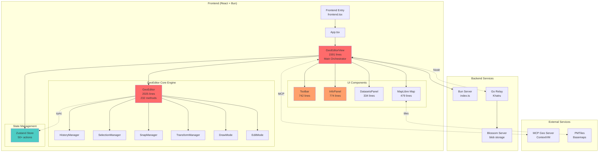
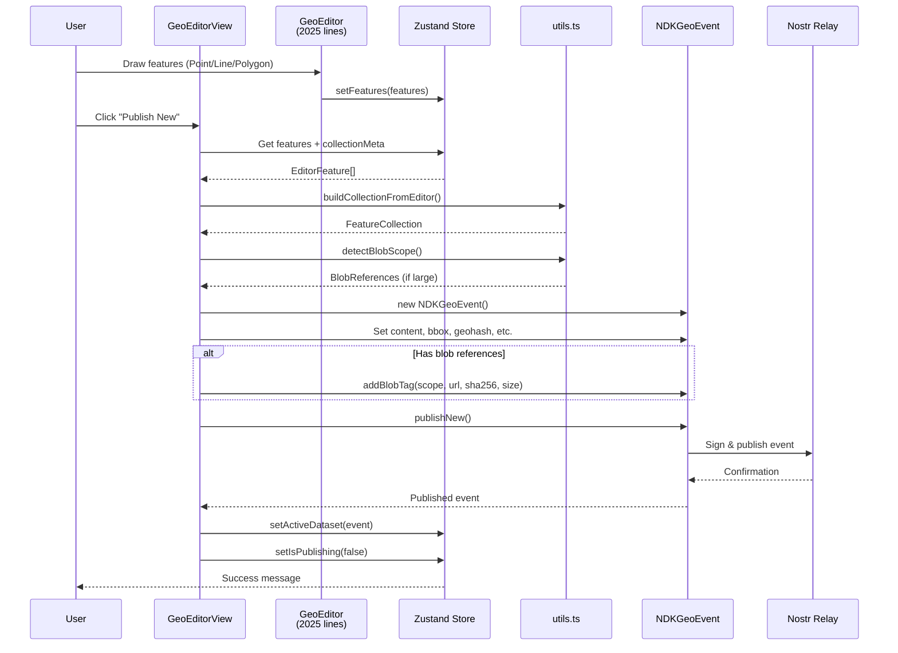
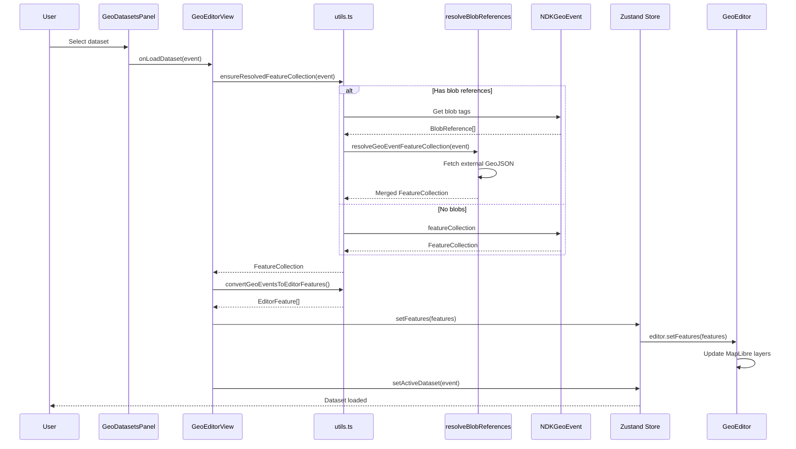
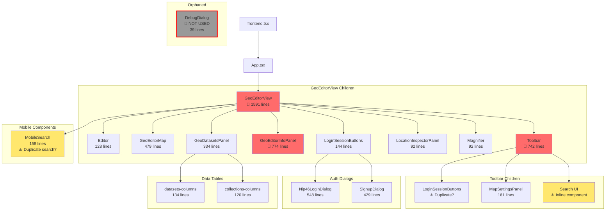
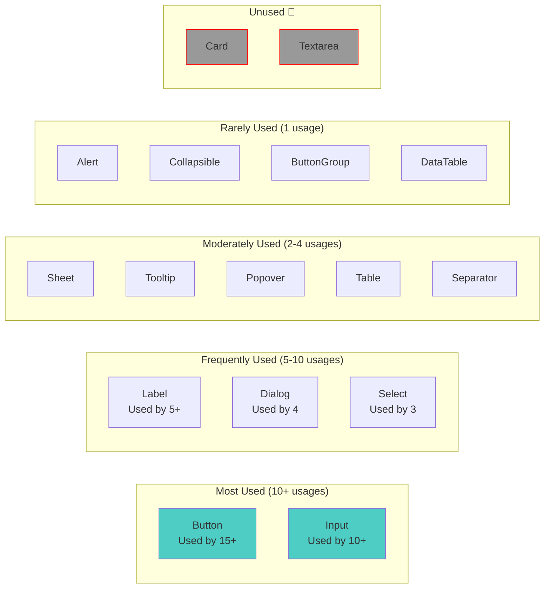
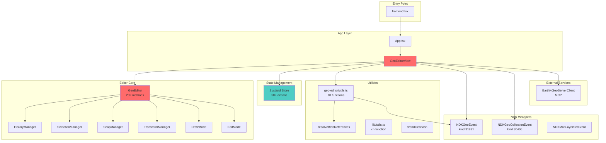
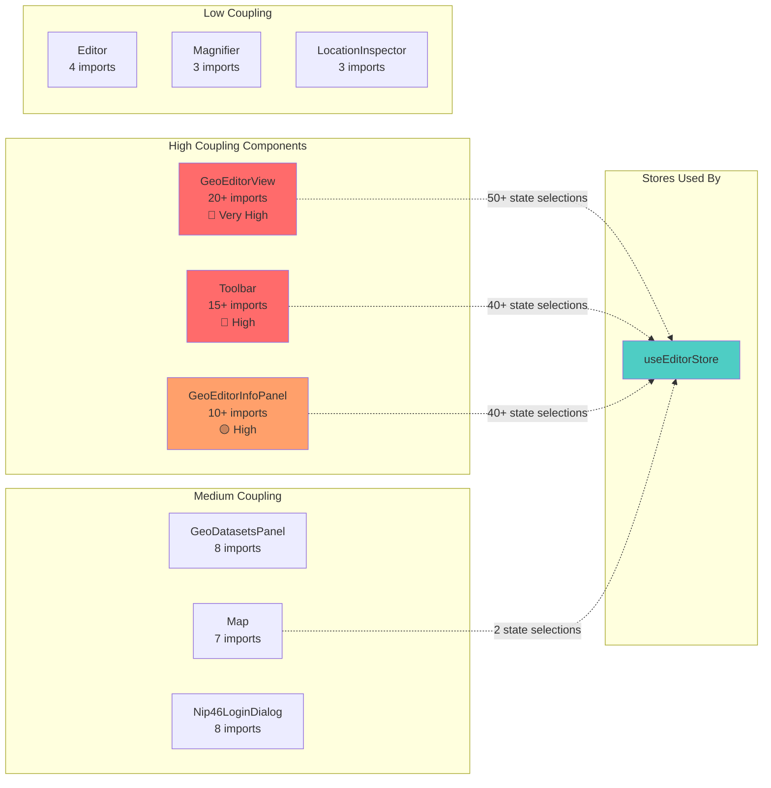

# Earthly - Architecture Analysis & Visualization

Generated: 2025-12-28

## Table of Contents
1. [Directory Structure Overview](#directory-structure-overview)
2. [Architecture Diagrams](#architecture-diagrams)
3. [Component Hierarchy](#component-hierarchy)
4. [Module Dependencies](#module-dependencies)
5. [Function/Method Inventory](#functionmethod-inventory)
6. [Issues & Refactoring Opportunities](#issues--refactoring-opportunities)

---

## Directory Structure Overview

```
src/
├── components/           # Shared UI components (334-774 lines)
│   ├── ui/              # Radix-based primitives (16 components, 19-163 lines)
│   ├── GeoDatasetsPanel.tsx (334 lines) ⚠️ Large
│   ├── GeoEditorInfoPanel.tsx (774 lines) ⚠️ Very Large
│   ├── LoginSessionButtom.tsx (144 lines) ⚠️ Typo in filename
│   ├── Nip46LoginDialog.tsx (548 lines) ⚠️ Large
│   ├── SignupDialog.tsx (429 lines) ⚠️ Large
│   ├── DebugDialog.tsx (39 lines) 🔴 ORPHANED
│   ├── datasets-columns.tsx (134 lines)
│   └── collections-columns.tsx (120 lines)
│
├── features/
│   └── geo-editor/      # Main editor feature
│       ├── core/        # Editor engine
│       │   ├── GeoEditor.ts (2025 lines) 🔴 VERY LARGE
│       │   ├── managers/ (4 files, 158-184 lines each)
│       │   │   ├── HistoryManager.ts
│       │   │   ├── SelectionManager.ts
│       │   │   ├── SnapManager.ts
│       │   │   └── TransformManager.ts
│       │   ├── modes/ (2 files)
│       │   │   ├── DrawMode.ts (282 lines)
│       │   │   └── EditMode.ts (330 lines)
│       │   ├── types/
│       │   └── utils/
│       │       └── geometry.ts (139 lines)
│       ├── components/ (8 files)
│       │   ├── Editor.tsx (128 lines)
│       │   ├── Map.tsx (479 lines) ⚠️ Large
│       │   ├── Toolbar.tsx (742 lines) ⚠️ Very Large
│       │   ├── MapSettingsPanel.tsx (161 lines)
│       │   ├── LocationInspectorPanel.tsx (92 lines)
│       │   ├── MobileSearch.tsx (158 lines)
│       │   └── Magnifier.tsx (92 lines)
│       ├── GeoEditorView.tsx (1591 lines) 🔴 VERY LARGE - Orchestrator
│       ├── store.ts (473 lines) - Zustand store (50+ actions)
│       ├── types.ts
│       └── utils.ts (206 lines) - 10 utility functions
│
├── lib/                 # Shared libraries & utilities
│   ├── ndk/            # Nostr Dev Kit wrappers
│   │   ├── NDKGeoEvent.ts (354 lines) ⚠️ Large
│   │   ├── NDKGeoCollectionEvent.ts (152 lines)
│   │   └── NDKMapLayerSetEvent.ts (68 lines)
│   ├── geo/
│   │   └── resolveBlobReferences.ts (58 lines)
│   ├── hooks/
│   │   ├── useStations.ts (181 lines)
│   │   └── useIsMobile.ts (5 lines)
│   ├── fixtures.ts (seed data utilities)
│   ├── worldGeohash.ts (137 lines)
│   └── utils.ts (single function: cn)
│
├── ctxcn/              # MCP Geo Server Client
│   └── EarthlyGeoServerClient.ts (182 lines)
│
├── config/             # Environment configuration
│   ├── env.schema.ts   # Zod validation
│   ├── env.client.ts   # Frontend config
│   ├── env.server.ts   # Backend config
│   ├── index.ts
│   └── platform.ts
│
├── App.tsx (20 lines)
├── frontend.tsx (entry point)
├── index.ts (207 lines) - Bun server
├── blossom.ts (229 lines) - Blossom blob server
└── APITester.tsx (old component?)

map-scripts/            # PMTiles chunking system
├── index.ts (500 lines)
├── geohashWorld.ts
└── geohashWorld.test.ts

relay/                  # Go Khatru relay
└── main.go
```

### File Size Analysis

**🔴 Critical (>1000 lines):**
- `GeoEditor.ts` - 2025 lines (232 methods!)
- `GeoEditorView.tsx` - 1591 lines

**⚠️ Large (500-1000 lines):**
- `GeoEditorInfoPanel.tsx` - 774 lines
- `Toolbar.tsx` - 742 lines
- `Nip46LoginDialog.tsx` - 548 lines
- `store.ts` - 473 lines

**⚠️ Medium-Large (300-500 lines):**
- `Map.tsx` - 479 lines
- `SignupDialog.tsx` - 429 lines
- `NDKGeoEvent.ts` - 354 lines
- `GeoDatasetsPanel.tsx` - 334 lines
- `EditMode.ts` - 330 lines

---

## Architecture Diagrams

### 1. High-Level System Architecture



### 2. Data Flow - Publishing a Dataset



### 3. Data Flow - Loading a Dataset



---

## Component Hierarchy

### Main Component Tree



### UI Primitive Component Usage



---

## Module Dependencies

### Core Module Relationships



### Import Coupling Analysis



---

## Function/Method Inventory

### GeoEditor.ts (Core Engine)

**Class:** `GeoEditor` (2025 lines, 232 methods)

**Public API Methods (20+):**
- `setMode(mode)` - Switch between static/edit/draw modes
- `setFeatures(features)` - Load features into editor
- `getFeatures()` - Get all features
- `setSnappingEnabled(enabled)` - Toggle snapping
- `setPanLocked(locked)` - Lock map panning
- `undo()` / `redo()` - History operations
- `deleteSelected()` - Delete selected features
- `selectAll()` / `deselectAll()` - Selection operations
- `finishDrawing()` - Complete current drawing
- `destroy()` - Cleanup

**Managers (4):**
- `HistoryManager` - Undo/redo stack management
- `SelectionManager` - Feature selection logic
- `SnapManager` - Vertex snapping during drawing/editing
- `TransformManager` - Move/rotate transformations

**Modes (4):**
- `DrawPointMode` - Point drawing
- `DrawLineStringMode` - Line drawing
- `DrawPolygonMode` - Polygon drawing
- `EditMode` - Feature editing

**Private Methods (200+):**
- Layer setup (40+ methods)
- Event handlers (60+ methods)
- Geometry operations (30+ methods)
- Rendering helpers (40+ methods)
- State management (30+ methods)

**🔴 Issue:** GeoEditor is a god object with too many responsibilities

---

### store.ts (Zustand State)

**Actions (50+):**

**Editor State:**
- `setEditor`, `setFeatures`, `setMode`, `setSelectedFeatureIds`
- `setSnappingEnabled`, `setPanLocked`, `setCanFinishDrawing`
- `setHistoryState`, `updateStats`

**Dataset State:**
- `setCollectionMeta`, `setActiveDataset`, `setDatasetVisibility`

**Publishing State:**
- `setIsPublishing`, `setPublishMessage`, `setPublishError`

**Blob References:**
- `setBlobReferences`, `setBlobDraftUrl`, `setBlobDraftStatus`
- `fetchBlobReference`, `previewBlobReference`, `removeBlobReference`

**View Mode:**
- `setViewMode`, `setViewDataset`, `setViewCollection`

**UI State (15+):**
- `setShowTips`, `setShowDatasetsPanel`, `setShowInfoPanel`
- `setMobileDatasetsOpen`, `setMobileInfoOpen`, `setMobileToolsOpen`
- `setMobileSearchOpen`, `setMobileActionsOpen`
- `setInspectorActive`

**Search State:**
- `setSearchQuery`, `setSearchResults`, `setSearchLoading`, `setSearchError`
- `performSearch`, `clearSearch`

**Map Settings:**
- `setMapSource`, `setShowMapSettings`

---

### geo-editor/utils.ts (10 utility functions)

1. `convertGeoEventsToEditorFeatures(events)` - NDK events → Editor format
2. `convertGeoEventsToFeatureCollection(events)` - NDK events → GeoJSON
3. `fetchGeoJsonPayload(url)` - Fetch external GeoJSON
4. `ensureFeatureCollection(payload)` - Validate GeoJSON
5. `summarizeFeatureCollection(collection)` - Count features by type
6. `detectBlobScope(collection)` - Find large features for external storage
7. `sanitizeEditorProperties(props)` - Remove internal properties
8. `createDefaultCollectionMeta()` - Create empty metadata
9. `extractCollectionMeta(collection)` - Parse metadata from GeoJSON
10. `parseCustomValue(value)` - Parse string to proper type

---

### NDKGeoEvent.ts (Nostr Event Wrapper)

**Class:** `NDKGeoEvent extends NDKEvent`

**Getters/Setters (20+):**
- `featureCollection` - Parse/stringify GeoJSON content
- `datasetId` - d tag accessor
- `boundingBox` - bbox tag (west,south,east,north)
- `geohash` - g tag
- `crs` - Coordinate reference system
- `checksum` - SHA-256 of content
- `size` - Byte length
- `version` - v tag
- `relayUrl` - r tag
- `hashtags` - t tags
- `collectionId` - Back-reference to collection

**Methods:**
- `calculateBoundingBox()` - Compute bbox from features
- `calculateGeohash()` - Compute geohash from centroid
- `syncMetadata()` - Update all derived tags
- `getBlobReferences()` - Parse blob tags
- `addBlobTag(scope, url, sha256, size)` - Add blob reference
- `removeBlobTag(scope, featureId?)` - Remove blob reference
- `publishNew()` - Create new event and publish
- `publishUpdate()` - Update existing event

---

### EarthlyGeoServerClient.ts (MCP Integration)

**Class:** `EarthlyGeoServerClient`

**Methods:**
- `SearchLocation(query, limit)` - Nominatim location search
- `ReverseLookup(lat, lon, zoom)` - Reverse geocoding

**Singleton:**
- `earthlyGeoServer` - Pre-configured client instance

---

### resolveBlobReferences.ts

**Function:** `resolveGeoEventFeatureCollection(event)`
- Fetches external GeoJSON blobs
- Merges with inline features
- Replaces placeholder features with full geometry

---

## Issues & Refactoring Opportunities

### 🔴 Critical Issues

#### 1. GeoEditor God Object
**File:** `src/features/geo-editor/core/GeoEditor.ts` (2025 lines, 232 methods)

**Problems:**
- Single class with too many responsibilities
- Difficult to test individual features
- Hard to understand and modify
- Violates Single Responsibility Principle

**Refactoring Suggestions:**
```
Current:
GeoEditor (2025 lines)
  ├── Layer management (40+ methods)
  ├── Event handling (60+ methods)
  ├── Geometry operations (30+ methods)
  ├── Rendering (40+ methods)
  └── State management (30+ methods)

Proposed:
GeoEditor (coordinator, ~300 lines)
  ├── LayerManager (layer setup/rendering)
  ├── EventHandler (map events)
  ├── GeometryService (geometry operations)
  ├── HistoryManager (already extracted ✓)
  ├── SelectionManager (already extracted ✓)
  ├── SnapManager (already extracted ✓)
  └── TransformManager (already extracted ✓)
```

#### 2. GeoEditorView Orchestration Layer
**File:** `src/features/geo-editor/GeoEditorView.tsx` (1591 lines)

**Problems:**
- Very large orchestration component
- Mixes UI rendering with business logic
- 50+ state selections from store
- Difficult to test

**Refactoring Suggestions:**
- Extract business logic into custom hooks
- Split into smaller sub-components
- Use composition over single large component

```typescript
// Proposed structure:
GeoEditorView (main, ~300 lines)
  ├── useEditorLifecycle() - Editor setup/teardown
  ├── useDatasetManagement() - Load/save datasets
  ├── usePublishing() - Publishing logic
  ├── useSearch() - Search functionality
  └── Sub-components:
      ├── EditorCanvas
      ├── EditorSidebar
      └── EditorToolbar
```

#### 3. Toolbar Complexity
**File:** `src/features/geo-editor/components/Toolbar.tsx` (742 lines)

**Problems:**
- Inline search component duplicates MobileSearch logic
- Too many responsibilities
- 40+ state selections

**Refactoring Suggestions:**
- Extract SearchBar as shared component
- Split desktop/mobile toolbars
- Reduce direct store coupling

---

### ⚠️ Medium Priority Issues

#### 4. Search Component Duplication

**Files:**
- `Toolbar.tsx` lines 80-123 (inline SearchBar)
- `MobileSearch.tsx` lines 7-61 (component)

**Issue:** Nearly identical search input implementation

**Solution:** Extract to shared component

```typescript
// Proposed: src/components/ui/search-bar.tsx
export function SearchBar({
  query,
  results,
  loading,
  error,
  onQueryChange,
  onSubmit,
  onClear,
  placeholder = "Search locations..."
}: SearchBarProps) {
  // Shared implementation
}
```

#### 5. Large Panel Components

**Files:**
- `GeoEditorInfoPanel.tsx` (774 lines)
- `GeoDatasetsPanel.tsx` (334 lines)

**Issue:** Complex panels with multiple modes/tabs

**Solution:** Split into mode-specific components

```
GeoEditorInfoPanel
  ├── EditModePanel (feature properties)
  ├── ViewModePanel (dataset viewer)
  └── CollectionViewPanel (collection viewer)

GeoDatasetsPanel
  ├── DatasetsList
  ├── CollectionsList
  └── DatasetActions
```

#### 6. Large Auth Dialogs

**Files:**
- `Nip46LoginDialog.tsx` (548 lines)
- `SignupDialog.tsx` (429 lines)

**Issue:** Complex multi-mode dialogs

**Solution:** Extract QR scanning to shared component, split modes

```
Nip46LoginDialog
  ├── PairingMode (QR scan)
  ├── ConnectMode (manual entry)
  └── QRScanner (shared)

SignupDialog
  ├── CreateMode
  ├── ImportMode
  └── QRScanner (shared)
```

---

### 🟡 Low Priority Issues

#### 7. Orphaned Component

**File:** `src/components/DebugDialog.tsx` (39 lines)

**Issue:** Not imported anywhere in the codebase

**Solutions:**
- If useful: Integrate into GeoEditorInfoPanel or GeoDatasetsPanel for debugging
- If not needed: Delete

#### 8. Filename Typo

**File:** `src/components/LoginSessionButtom.tsx`

**Issue:** "Buttom" instead of "Button"

**Solution:** Rename to `LoginSessionButton.tsx`

```bash
git mv src/components/LoginSessionButtom.tsx src/components/LoginSessionButton.tsx
# Update imports
```

#### 9. Unused UI Components

**Files:**
- `src/components/ui/card.tsx` - Not used
- `src/components/ui/textarea.tsx` - Only referenced in APITester.tsx

**Solution:** Remove if truly unused, or add to component library docs

#### 10. APITester.tsx

**File:** `src/APITester.tsx`

**Issue:** Unclear if this is still used or is old test code

**Solution:** Investigate usage, document or remove

---

### 📊 Code Metrics Summary

| Metric | Count | Notes |
|--------|-------|-------|
| **Total .tsx files** | 31 | |
| **Total .ts files** | 30 | |
| **Very Large Files (>1000 lines)** | 2 | GeoEditor, GeoEditorView |
| **Large Files (500-1000 lines)** | 4 | InfoPanel, Toolbar, Nip46Dialog, store |
| **Orphaned Components** | 1 | DebugDialog |
| **Duplicate Patterns** | 1 | SearchBar in Toolbar + MobileSearch |
| **Unused UI Components** | 2 | Card, Textarea |
| **Total Methods in GeoEditor** | 232 | 🔴 Too many |
| **Total Store Actions** | 50+ | Consider splitting |
| **Components using Store** | 6 | Moderate coupling |

---

### 🎯 Refactoring Priority List

1. **Priority 1 (Critical):**
   - [ ] Refactor GeoEditor god object into service classes
   - [ ] Split GeoEditorView into hooks + smaller components

2. **Priority 2 (High):**
   - [ ] Extract shared SearchBar component
   - [ ] Split large panel components (InfoPanel, DatasetsPanel)
   - [ ] Refactor Toolbar to reduce complexity

3. **Priority 3 (Medium):**
   - [ ] Extract QR scanning to shared component
   - [ ] Split auth dialogs into mode-specific components
   - [ ] Consider splitting Zustand store by domain

4. **Priority 4 (Low):**
   - [ ] Handle orphaned DebugDialog
   - [ ] Fix LoginSessionButtom.tsx filename typo
   - [ ] Remove unused UI components
   - [ ] Investigate APITester.tsx

---

### 🏗️ Architecture Strengths

✅ **Good Practices:**
1. **Clear feature separation** - `/features/geo-editor/` is well organized
2. **Manager pattern** - History, Selection, Snap, Transform extracted
3. **Centralized state** - Single Zustand store
4. **Type safety** - Extensive TypeScript usage
5. **UI primitives** - Reusable Radix-based components
6. **Nostr abstractions** - NDKGeoEvent, NDKGeoCollectionEvent wrappers
7. **Utility separation** - Clear util modules for specific tasks

✅ **Well-Structured Modules:**
- `managers/` - Clean separation of editor concerns
- `modes/` - Drawing mode encapsulation
- `lib/ndk/` - Nostr event wrappers
- `components/ui/` - Reusable primitives

---

## Recommendations

### Short Term (1-2 weeks)
1. Fix filename typo: `LoginSessionButtom.tsx` → `LoginSessionButton.tsx`
2. Resolve DebugDialog (integrate or delete)
3. Extract SearchBar component
4. Document APITester.tsx purpose

### Medium Term (1-2 months)
1. Split GeoEditorView into smaller components + custom hooks
2. Refactor Toolbar to reduce complexity
3. Split InfoPanel and DatasetsPanel by mode
4. Extract shared QRScanner component

### Long Term (3-6 months)
1. **Major refactor:** Break down GeoEditor god object
   - Extract LayerManager
   - Extract EventHandler
   - Extract GeometryService
   - Keep existing managers (History, Selection, Snap, Transform)
2. Consider domain-based store splitting
3. Add comprehensive test coverage for core modules

---

## Conclusion

The codebase is **well-organized at the macro level** with clear feature separation, but suffers from **micro-level complexity** in a few critical files:

- **GeoEditor.ts** (2025 lines, 232 methods) is a god object
- **GeoEditorView.tsx** (1591 lines) is an overloaded orchestrator
- Several large components (700+ lines) could be split

The manager pattern extraction (History, Selection, Snap, Transform) shows the right direction. Continuing this pattern for other GeoEditor responsibilities would greatly improve maintainability.

The Zustand store is well-designed but large (50+ actions). Consider splitting by domain if it grows further.

Overall: **6/10 maintainability** - Good structure, needs focused refactoring on the largest files.
