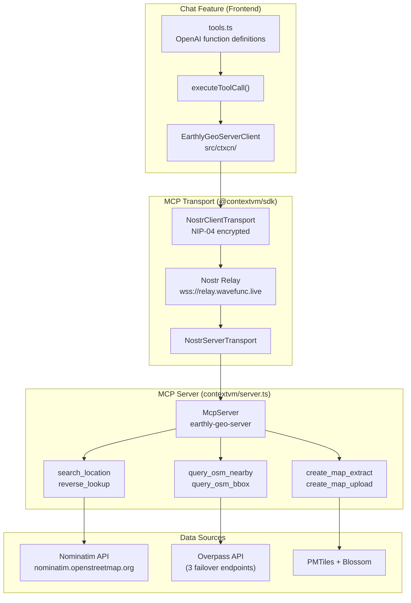
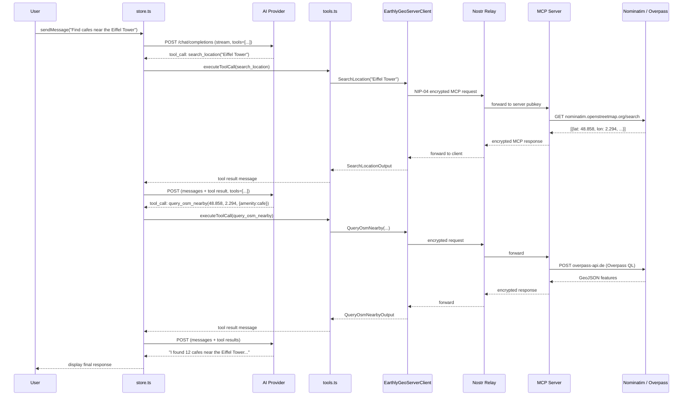
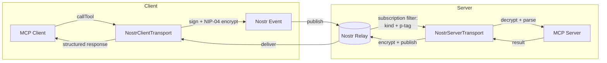

# Chat Feature Architecture

Multi-provider AI chat with Cashu micropayments and geo tool calling.

## Files

| File | Purpose |
|------|---------|
| `routstr.ts` | OpenAI-compatible API client — streaming, provider config, token estimation |
| `store.ts` | Zustand store — messages, payment orchestration, tool call loop |
| `tools.ts` | Geo tool definitions and execution via EarthlyGeoServerClient (MCP) |
| `ChatPanel.tsx` | React UI — provider/model picker, message list, input |
| `index.ts` | Public exports |

## Providers

All providers use the OpenAI `/v1/chat/completions` API format.

| Provider | Base URL | Payment |
|----------|----------|---------|
| **Routstr** | `https://api.routstr.com/v1` | Cashu prepay + refund |
| **LM Studio** | `http://localhost:1234/v1` | Free |
| **Ollama** | `http://localhost:11434/v1` | Free |
| **Custom** | User-provided | Free |

Provider selection triggers model list reload via `GET /models`.

## Message Flow

```
User types message
    │
    ▼
sendMessage() ─── store.ts
    │
    ├─ [Routstr only] Estimate cost → mint Cashu token via NIP-60 wallet
    │
    ▼
streamChatCompletion() ─── routstr.ts
    │
    ├─ POST /chat/completions  (stream: true)
    │   Headers: X-Cashu (payment), Authorization (if custom)
    │   Body: model, messages, max_tokens, tools (if enabled)
    │
    ├─ Parse SSE stream → onToken callbacks → UI updates
    │
    ├─ Accumulate tool calls across chunks
    │
    ▼
┌─ Tool calls present? ──────────────────────────────────┐
│ YES:                                                    │
│  1. Add assistant message with tool_calls to history    │
│  2. Execute each tool via executeToolCall() (tools.ts)  │
│  3. Add tool result messages (role: 'tool')             │
│  4. Loop back to streamChatCompletion with new messages │
│  5. Max 5 rounds to prevent infinite loops              │
│                                                         │
│ NO:                                                     │
│  Add assistant message → process refund → done          │
└─────────────────────────────────────────────────────────┘
```

## Payment Model (Routstr only)

**Prepay with automatic refund.**

1. **Estimate** — `estimateTokens()` approximates input tokens (`text.length / 4`), assumes `DEFAULT_MAX_TOKENS` (512) for output. Calculates cost using model pricing (input/output per 1M tokens + per-request fee) with a 5 sat buffer. Minimum prepayment: 10 sats.

2. **Pay** — NIP-60 wallet mints a Cashu token for the estimated amount. Sent in the `X-Cashu` request header.

3. **Refund** — Server returns unused balance as a Cashu token in the response `X-Cashu` header. The store receives it back into the wallet immediately. Refunds are also extracted from error responses (`error.refund_token` in JSON body).

Local providers skip all payment logic.

## Tool Calling

Four read-only geo tools, executed via `EarthlyGeoServerClient` (MCP over Nostr transport):

| Tool | Parameters | Returns |
|------|-----------|---------|
| `search_location` | `query`, `limit?` | Places with coordinates, bbox, addresses |
| `reverse_lookup` | `lat`, `lon`, `zoom?` | Address for coordinates |
| `query_osm_nearby` | `lat`, `lon`, `radius?`, `filters?`, `limit?` | GeoJSON features near a point |
| `query_osm_bbox` | `west`, `south`, `east`, `north`, `filters?`, `limit?` | GeoJSON features in bounding box |

Tools use OpenAI function calling format. Toggled on/off in the UI — when disabled, no `tools` array is sent with the request.

**Example multi-step chain:**
```
User: "Find cafes near Times Square"
  → Assistant calls search_location("Times Square")
  → Tool returns coords (40.758, -73.985)
  → Assistant calls query_osm_nearby(lat, lon, filters: {amenity: cafe})
  → Tool returns 12 cafes
  → Assistant: "I found several cafes near Times Square..."
```

### MCP Tool Origin

The tools originate from an MCP server (`contextvm/server.ts`) that wraps OpenStreetMap APIs. The chat feature connects to it over Nostr relays using `@contextvm/sdk`.



### Tool Call Lifecycle

Shows how an AI model's tool call flows through the system and back into the conversation:



### MCP over Nostr Transport

The key architectural choice: MCP requests travel as encrypted Nostr DMs rather than HTTP. This enables decentralized server discovery — the client only needs the server's public key and a relay URL.



**Client identity:** Anonymous ephemeral key (no login required)
**Server identity:** Hardcoded pubkey `ceadb7d...b304cc`
**Relays:** `wss://relay.wavefunc.live` (production), `ws://localhost:3334` (dev)

## Streaming

- Uses `ReadableStream` with `TextDecoder` to parse SSE chunks
- Each `data:` line parsed as JSON; `delta.content` emitted via `onToken` callback
- Tool call arguments streamed incrementally, assembled in a `Map<index, ToolCall>`
- Stream terminates on `[DONE]` token
- `AbortController` supports cancellation

## Store

Zustand store with `persist` middleware. Only settings persist across sessions (provider, model, tools toggle). Messages and payment stats reset on reload.

**Key state:**

| Group | Fields |
|-------|--------|
| Provider | `provider`, `customEndpoint`, `customApiKey` |
| Models | `models`, `selectedModel`, `modelsLoading`, `modelsError` |
| Chat | `messages`, `isStreaming`, `streamingContent`, `executingTools`, `error` |
| Settings | `maxTokens`, `toolsEnabled` |
| Stats | `totalSpent`, `totalRefunded` |

## UI Structure

```
ChatPanel
├─ Header
│  ├─ Provider dropdown (routstr / lmstudio / ollama / custom)
│  ├─ Clear chat button
│  ├─ Custom endpoint config (shown when provider=custom)
│  ├─ Model dropdown with pricing info
│  └─ Wallet status (or "Local - free") + Tools toggle
├─ Messages
│  ├─ MessageBubble per message
│  │  ├─ User — right-aligned, primary color
│  │  ├─ Assistant — left-aligned, muted
│  │  ├─ Tool calls — orange wrench badges
│  │  └─ Tool results — blue card, scrollable, truncated
│  └─ Streaming indicator ("Thinking..." / "Executing geo tools...")
└─ Input
   ├─ Auto-resizing textarea (Enter sends, Shift+Enter newline)
   └─ Send / Cancel button
```
