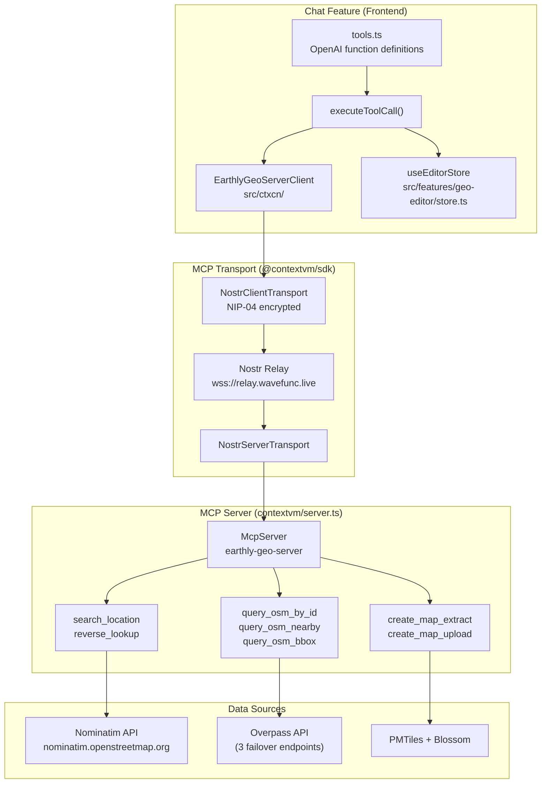
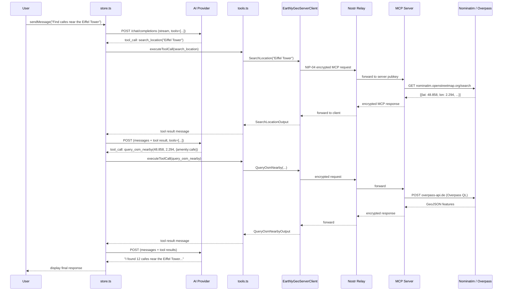
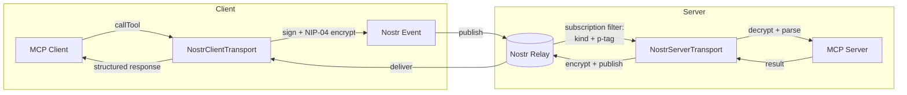
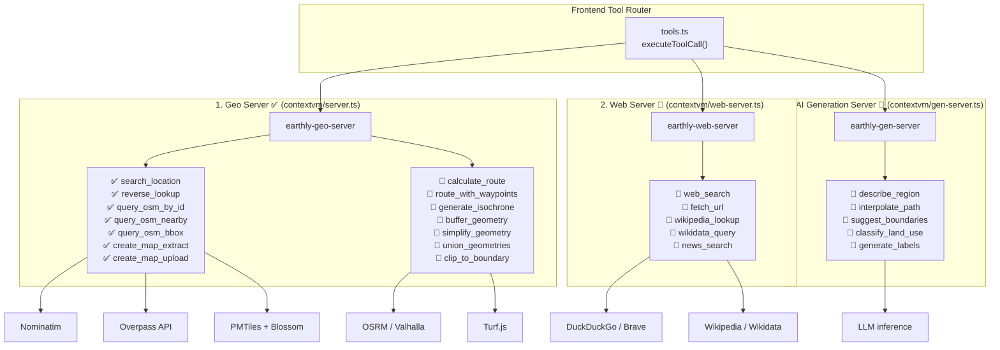
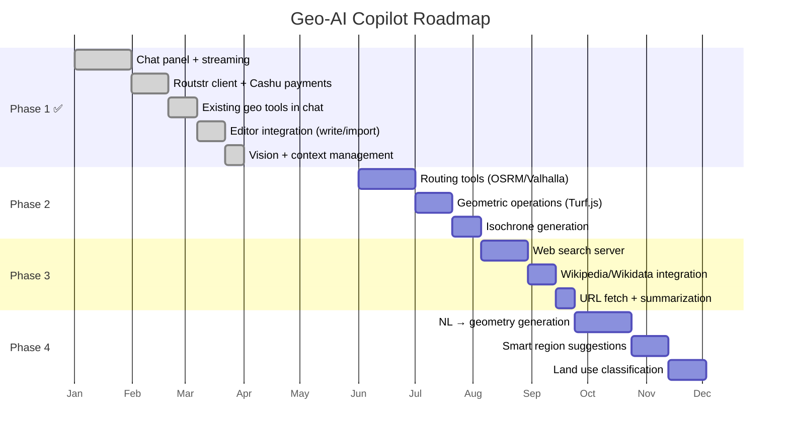

# Chat Feature Architecture

Multi-provider AI chat with Cashu micropayments and geo tool calling.

## Files

| File | Purpose |
|------|---------|
| `routstr.ts` | OpenAI-compatible API client — streaming, provider config, token estimation |
| `store.ts` | Zustand store — messages, payment orchestration, tool call loop |
| `tools.ts` | Geo tool definitions and execution via EarthlyGeoServerClient (MCP) |
| `ChatPanel.tsx` | React UI — provider/model picker, message list, input |
| `index.ts` | Public exports |

## Providers

All providers use the OpenAI `/v1/chat/completions` API format.

| Provider | Base URL | Payment |
|----------|----------|---------|
| **Routstr** | `https://api.routstr.com/v1` | Cashu prepay + refund |
| **LM Studio** | `http://localhost:1234/v1` | Free |
| **Ollama** | `http://localhost:11434/v1` | Free |
| **Custom** | User-provided | Free |

Provider selection triggers model list reload via `GET /models`.

## Message Flow

```
User types message
    │
    ▼
sendMessage() ─── store.ts
    │
    ├─ [Routstr only] Estimate cost → mint Cashu token via NIP-60 wallet
    │
    ▼
streamChatCompletion() ─── routstr.ts
    │
    ├─ POST /chat/completions  (stream: true)
    │   Headers: X-Cashu (payment), Authorization (if custom)
    │   Body: model, messages, max_tokens, tools (if enabled)
    │
    ├─ Parse SSE stream → onToken callbacks → UI updates
    │
    ├─ Accumulate tool calls across chunks
    │
    ▼
┌─ Tool calls present? ──────────────────────────────────┐
│ YES:                                                    │
│  1. Add assistant message with tool_calls to history    │
│  2. Execute each tool via executeToolCall() (tools.ts)  │
│  3. Add tool result messages (role: 'tool')             │
│  4. Loop back to streamChatCompletion with new messages │
│  5. Max 5 rounds to prevent infinite loops              │
│                                                         │
│ NO:                                                     │
│  Add assistant message → process refund → done          │
└─────────────────────────────────────────────────────────┘
```

## Payment Model (Routstr only)

**Prepay with automatic refund.**

1. **Estimate** — `estimateTokens()` approximates input tokens (`text.length / 4`), assumes `DEFAULT_MAX_TOKENS` (512) for output. Calculates cost using model pricing (input/output per 1M tokens + per-request fee) with a 5 sat buffer. Minimum prepayment: 10 sats.

2. **Pay** — NIP-60 wallet mints a Cashu token for the estimated amount. Sent in the `X-Cashu` request header.

3. **Refund** — Server returns unused balance as a Cashu token in the response `X-Cashu` header. The store receives it back into the wallet immediately. Refunds are also extracted from error responses (`error.refund_token` in JSON body).

Local providers skip all payment logic.

## Tool Calling

Geo tools are a mix of:
- Read-only MCP queries (OSM/Nominatim via `EarthlyGeoServerClient`)
- Local map actions (importing features directly into the editor via `useEditorStore`)

| Tool | Parameters | Returns |
|------|-----------|---------|
| `get_editor_state` | `detail?` (`compact` default, `full` optional) | Compact editor/map state by default; full snapshot on demand |
| `capture_map_snapshot` | `mimeType?`, `quality?`, `maxWidth?`, `maxHeight?` | Snapshot metadata + `snapshotId` for vision handoff |
| `write_geojson_to_editor` | `geojson` or `geojsonText`, `replaceExisting?` | Imports custom GeoJSON directly into editor |
| `add_feature_to_editor` | `feature?` or `geometry`, `properties?`, `id?`, `replaceExisting?` | Adds one LLM-generated GeoJSON feature into editor |
| `search_location` | `query`, `limit?` | Places with coordinates, bbox, addresses |
| `reverse_lookup` | `lat`, `lon`, `zoom?` | Address for coordinates |
| `query_osm_by_id` | `osmType`, `osmId` | One OSM feature by exact id |
| `query_osm_nearby` | `lat`, `lon`, `radius?`, `filters?`, `limit?` | GeoJSON features near a point |
| `query_osm_bbox` | `west`, `south`, `east`, `north`, `filters?`, `limit?` | GeoJSON features in bounding box |
| `import_osm_to_editor` | `name`, optional bbox/point/filters | Imports matching OSM features into editor |

Tools use OpenAI function calling format. Toggled on/off in the UI — when disabled, no `tools` array is sent with the request.

When tools are enabled, each request gets an ephemeral system preflight message containing current map context JSON (center/zoom/bbox/layers/selection) so the model starts with map awareness before choosing tools.

**Example map-edit chain:**
```
User: "Take the river Rhine and bring it into the editor"
  → Assistant calls get_editor_state()
  → Assistant calls import_osm_to_editor(name: "Rhine", filters: {waterway: "river"})
  → Tool queries OSM + imports features directly into map editor
  → Assistant reports imported feature count
```

### MCP Tool Origin

The tools originate from an MCP server (`contextvm/server.ts`) that wraps OpenStreetMap APIs. The chat feature connects to it over Nostr relays using `@contextvm/sdk`.



### Tool Call Lifecycle

Shows how an AI model's tool call flows through the system and back into the conversation:



### MCP over Nostr Transport

The key architectural choice: MCP requests travel as encrypted Nostr DMs rather than HTTP. This enables decentralized server discovery — the client only needs the server's public key and a relay URL.



**Client identity:** Anonymous ephemeral key (no login required)
**Server identity:** Hardcoded pubkey `ceadb7d...b304cc`
**Relays:** `wss://relay.wavefunc.live` (production), `ws://localhost:3334` (dev)

## Roadmap: Planned MCP Servers & Tools

> Full design document: [docs/GEO_AI_ARCHITECTURE.md](../../../docs/GEO_AI_ARCHITECTURE.md)

### Design Principles

1. **No REST APIs** — All backend services are ContextVM servers over Nostr
2. **Bring Your Own AI (BYOAI)** — User chooses and pays for their AI provider directly (Routstr, Ollama, LM Studio, any OpenAI-compatible endpoint)
3. **ContextVM for Tools** — Domain-specific tools via MCP over Nostr, replacing traditional web servers
4. **Client-Side Orchestration** — Frontend handles AI <-> Tool coordination; no middleman sees queries or payments

Three ContextVM MCP servers are planned. The **Geo Server already exists**; the other two are next.

### Planned ContextVM Servers



### Server 1: Geo Server — new tools

Already running at `contextvm/server.ts`. These are additional tools to add:

| Tool | Backend | Description |
|------|---------|-------------|
| `calculate_route` | OSRM or Valhalla | A→B routing with travel mode (walk/bike/car) |
| `route_with_waypoints` | OSRM + Overpass | A→B routing that detours past POI categories |
| `generate_isochrone` | Valhalla | Travel-time polygons (e.g. "15 min walk from here") |
| `buffer_geometry` | Turf.js | Buffer a point/line/polygon by distance |
| `simplify_geometry` | Turf.js | Douglas-Peucker simplification |
| `union_geometries` | Turf.js | Merge overlapping polygons |
| `clip_to_boundary` | Turf.js | Clip features to an area boundary |

**Already in MCP server but not yet exposed to chat:**
- `create_map_extract` — extract PMTiles for a bbox (requires 2-step signing flow)
- `create_map_upload` — upload extracted tiles to Blossom

### Server 2: Web Server (planned)

New MCP server at `contextvm/web-server.ts` for internet research tools:

| Tool | Backend | Description |
|------|---------|-------------|
| `web_search` | DuckDuckGo / Brave | General web search |
| `fetch_url` | HTTP fetch + readability | Fetch and parse a webpage |
| `wikipedia_lookup` | Wikipedia API | Article by coordinates or topic |
| `wikidata_query` | SPARQL | Structured geo entity queries |
| `news_search` | News API | Recent news for a location |

### Server 3: AI Generation Server (planned)

New MCP server at `contextvm/gen-server.ts` for AI-assisted geometry creation:

| Tool | Description |
|------|-------------|
| `describe_region` | Natural language → polygon vertices ("Blue Banana" → polygon) |
| `interpolate_path` | Smooth path generation between points |
| `suggest_boundaries` | AI-suggested region boundaries from context |
| `classify_land_use` | Analyze satellite imagery for land classification |
| `generate_labels` | Smart label placement for features |

### Use Case Examples

| Category | Example Prompts |
|----------|-----------------|
| **Creative** | "Draw the Blue Banana megalopolis across Europe" |
| **Routing** | "Plan a scenic bike route avoiding hills" |
| | "Find the fastest walking path that passes a pharmacy" |
| **Historical** | "What buildings here are over 100 years old?" |
| | "Show me the historical boundary of this city in 1900" |
| **Analysis** | "What's the walkability score of this neighborhood?" |
| | "Show 15-minute isochrones from this transit stop" |
| **Discovery** | "Find all UNESCO sites within 50km" |
| | "What restaurants here have outdoor seating?" |
| **Research** | "Summarize recent news about this area" |
| | "What's the zoning classification for this parcel?" |
| **Planning** | "Suggest optimal locations for EV chargers" |
| | "Generate a walking tour of Art Deco buildings" |

### Implementation Phases



## Streaming

- Uses `ReadableStream` with `TextDecoder` to parse SSE chunks
- Each `data:` line parsed as JSON; `delta.content` emitted via `onToken` callback
- Tool call arguments streamed incrementally, assembled in a `Map<index, ToolCall>`
- Stream terminates on `[DONE]` token
- `AbortController` supports cancellation

## Store

Zustand store with `persist` middleware. Only settings persist across sessions (provider, model, tools toggle). Messages and payment stats reset on reload.

**Key state:**

| Group | Fields |
|-------|--------|
| Provider | `provider`, `customEndpoint`, `customApiKey` |
| Models | `models`, `selectedModel`, `modelsLoading`, `modelsError` |
| Chat | `messages`, `isStreaming`, `streamingContent`, `executingTools`, `error` |
| Settings | `maxTokens`, `toolsEnabled` |
| Stats | `totalSpent`, `totalRefunded` |

## UI Structure

```
ChatPanel
├─ Header
│  ├─ Provider dropdown (routstr / lmstudio / ollama / custom)
│  ├─ Clear chat button
│  ├─ Custom endpoint config (shown when provider=custom)
│  ├─ Model dropdown with pricing info
│  └─ Wallet status (or "Local - free") + Tools toggle
├─ Messages
│  ├─ MessageBubble per message
│  │  ├─ User — right-aligned, primary color
│  │  ├─ Assistant — left-aligned, muted
│  │  ├─ Tool calls — orange wrench badges
│  │  └─ Tool results — blue card, scrollable, truncated
│  └─ Streaming indicator ("Thinking..." / "Executing geo tools...")
└─ Input
   ├─ Auto-resizing textarea (Enter sends, Shift+Enter newline)
   └─ Send / Cancel button
```
